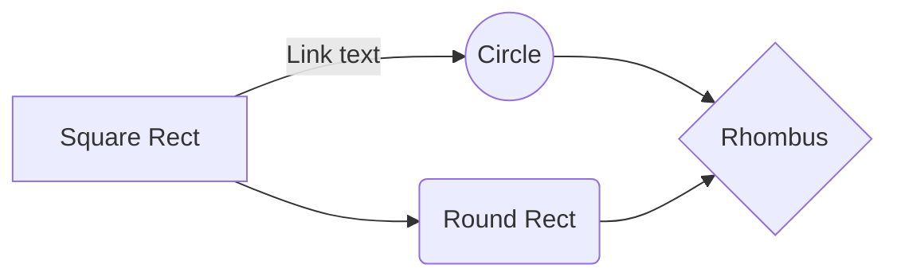

# Sistema de hogares

**¿Cómo establecer una casa?**

Para establecer un hogar en nuestro servidor, debe abrir su chat en la ubicación exacta en la que desea guardar su hogar y escribir el siguiente comando: */savehome [NombreDeHogar]*

Después de hacer esto, se le enviará el resultado del comando. Si la casa no pudo guardar, significa que no tiene más espacios para guardar hogares, ya hay una casa con ese nombre o no tiene suficientes permisos.

**¿Cómo editar las opciones del hogar?**

